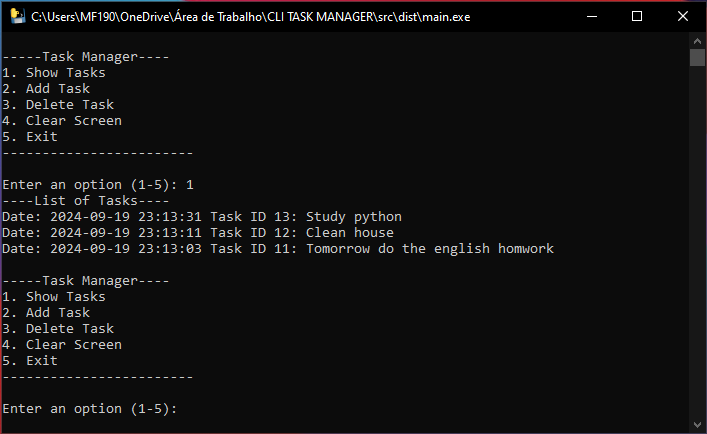

# CLI Task Manager

## Descrição
Este programa em Python é um sistema básico de gerenciamento de tarefas usando uma interface de terminal. Ele permite que os usuários gerenciem suas tarefas, fornecendo opções para adicionar, mostrar e excluir tarefas. É simples, mas útil.

## Funcionalidades
- **Adicionar**: Usuários podem adicionar várias tarefas ao programa.
- **Excluir**: Usuários podem excluir tarefas que foram previamente adicionadas.
- **Mostrar**: Usuários podem visualizar todas as tarefas que foram adicionadas.

## Imagens do Programa
Aqui estão algumas imagens que mostram o programa em funcionamento:

### Menu do Programa


### Tarefas Salvas


### Limpando Histórico de Tela


### Fechando Programa


## Uso
1. **Clone o repositório:**
   ```bash
   git clone https://github.com/andreferreiraext123/cli-task-manager
   cd cli-task-manager

2. **Execute o programa:**
    ```bash
    python task_manager.py

3. **Interaja com o menu:**
    ```bash
    --- Task Manager ---
    1. Mostrar tarefas
    2. Adicionar tarefa
    3. Remover tarefa
    4. Limpar tarefa
    5. Sair


4.**Descricao do menu:**
    - Mostrar tarefas: Exibe todas as tarefas.
    - Adicionar tarefa: Solicita uma descrição da tarefa e a adiciona à lista.
    - Remover tarefa: Solicita o número da tarefa a ser removida.
    - Limpar tela: Remove o histórico de tela
    - Sair: Encerra o programa.


## Diagrama com a estrutura do projeto

