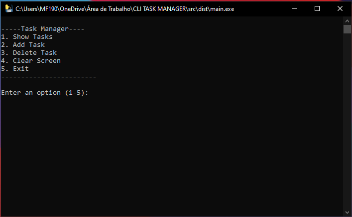
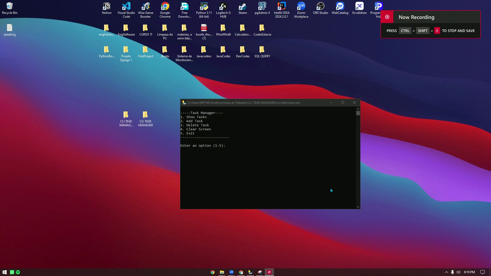

# CLI Task Manager

## Descrição
Este programa em Python é um sistema básico de gerenciamento de tarefas via terminal. Ele permite que os usuários gerenciem suas tarefas, oferecendo opções para adicionar, visualizar e excluir tarefas. Simples, mas prático para acompanhar suas pendências.

## Funcionalidades
- **Adicionar**: Usuários podem adicionar múltiplas tarefas ao programa.
- **Excluir**: Usuários podem remover tarefas que foram previamente adicionadas.
- **Mostrar**: Usuários podem visualizar todas as tarefas registradas.

## Tecnologias Utilizadas
- **Python**: Linguagem de programação principal usada para o desenvolvimento.
- **SQLite**: Banco de dados leve utilizado para armazenar as tarefas.
- **PyInstaller**: Ferramenta usada para compilar o projeto em um executável.

## Download do Executável
Você pode baixar o executável do programa [aqui](https://github.com/andreferreiraext123/cli-task-manager/releases/download/untagged-b30cf9892f2fded3da52/main.exe).

## Imagens do Programa
Aqui estão algumas imagens que mostram o programa em funcionamento:

### Menu do Programa


### Tarefas Salvas


### Limpando Histórico de Tela


### Programa em Execucao



## Uso
1. **Clone o repositório:**
   ```bash
   git clone https://github.com/andreferreiraext123/cli-task-manager
   cd cli-task-manager
2. **Execute o programa:**
    ```bash
    python task_manager.py

3. **Interaja com o menu:**
    ```bash
    --- Task Manager ---
    1. Mostrar tarefas
    2. Adicionar tarefa
    3. Remover tarefa
    4. Limpar tarefa
    5. Sair


4.**Descricao do menu:**
    - Mostrar tarefas: Exibe todas as tarefas.
    - Adicionar tarefa: Solicita uma descrição da tarefa e a adiciona à lista.
    - Remover tarefa: Solicita o número da tarefa a ser removida.
    - Limpar tela: Remove o histórico de tela
    - Sair: Encerra o programa.

## Diagrama da Estrutura do Projeto

